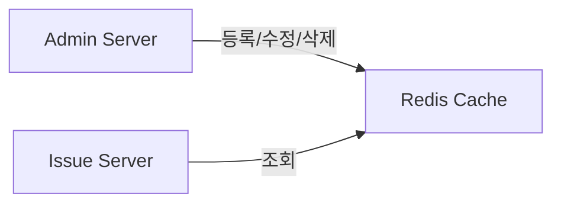

# coupon-issuance-system


## 🚀 빠른 시작

1. 의존 서비스 실행 (MySQL, Redis)
```bash
docker-compose up -d
```

2. Admin 서버 실행

```bash
go run ./cmd/admin-server
```

3. Issue 서버 실행

```bash
go run ./cmd/issue-server
```


## 🛠️ API 

### 1) 캠페인 생성

```bash
curl -X POST http://localhost:8081/admin.v1.CampaignService/CreateCampaign \
  -H "Content-Type: application/json" \
  -H "Connect-Protocol-Version: 1" \
  -d '{
    "name": "캠페인1",
    "couponIssueLimit": 1000,
    "issuanceStartTime": "2025-06-23T20:57:00+09:00"
  }'
```

### 2) 캠페인 조회

```bash
curl -X POST http://localhost:8081/admin.v1.CampaignService/GetCampaign \
  -H "Content-Type: application/json" \
  -H "Connect-Protocol-Version: 1" \
  -d '{
    "campaignId": "생성된_campaignId_값"
  }'

```


### 3) 쿠폰 발급

```bash
curl -X POST http://localhost:8082/issue.v1.IssueService/IssueCoupon \
  -H "Content-Type: application/json" \
  -H "Connect-Protocol-Version: 1" \
  -d '{
    "campaignId": "생성된_campaignId_값",
    "userId": "test"
  }'

```

## 설계


### 1. 캠페인 정보 캐싱 (with Redis)

- **관리 주체**: Admin Server
- **시나리오**
    1. Admin Server에서 캠페인 등록·수정·삭제 API 호출
    2. 내부 로직 처리 후 Redis에 캠페인 데이터 전체를 `HMSET`으로 저장
    3. Issue Server는 오직 Redis 조회(`HGETALL`)만 사용
- **특징**
    - TTL 없음 → 수동으로 갱신된 데이터만 존재
    - 캐시 미스 시(미구현)
        - Admin Server로 페일백 요청 후 Redis 재저장




### 2. 쿠폰 코드 생성기

- **위치**: `./util/code_generator.go`
- **목표**: 한글+숫자 조합 10자리 안전 랜덤 문자열 생성

| 항목          | 값                                    |
| ------------- | ------------------------------------- |
| 문자 집합     | 한글 36자 + 숫자 10자 = 총 46자       |
| 코드 길이     | 10자리                                |
| 조합 수       | 46¹⁰ ≈ 3.58×10¹⁶                      |
| 중복 확률(1M) | ≈ 0.0014% (사실상 중복 없음)           |


### 3. Redis 원자 연산 (Atomic INCR/DECR)

- 목적: 캠페인별로 발급 가능한 쿠폰 수량을 초과하지 않도록, 모든 서버 인스턴스에서 동시성 문제 없이 안전하게 제어합니다.
- 구현 방식:
  - 쿠폰 발급 시, Redis의 INCR 명령어로 해당 캠페인의 발급 카운터(campaign:{id}:issued_count)를 1 증가
  - 증가된 값이 캠페인에 설정된 최대 발급 수량을 초과하면, 즉시 DECR로 롤백하여 초과 발급을 방지
  - 실제 쿠폰 DB 저장에 실패한 경우에도, DECR로 카운터를 복구(롤백)
  - 이 과정은 모든 서버에서 원자적으로 처리되므로, 수평 확장 환경에서도 데이터 정합성이 보장
- 코드 참고:
  - internal/issue/service/limiter.go
  - internal/issue/service/issue_service.go

### 4. 비동기 쿠폰 저장 (미구현)

- **목표**: 쿠폰 발급 처리 후 저장을 비동기로 분리하여 DB 부하 지연 및 재시도 가능한 구조로 설계
- **현재 상태**: 동기 처리만 구현
- **아이디어**:
    - **Redis Stream**
        - 발급 요청을 Stream에 `XADD`
        - 별도 컨슈머 그룹이 Stream에서 읽어 DB 또는 영속 스토리지에 저장
    - **메시지 큐 기반 이벤트 아키텍처**
        - Kafka / RabbitMQ에 발급 이벤트 발행
        - 소비자(Worker)가 이벤트 구독 후 저장 및 후속 처리
    - **장점**
        - 발급 API 응답 지연 최소화
        - 장애 복구: 큐에 남은 메시지로 재처리 가능
        - 확장성: 저장 로직과 발급 로직을 독립적 서비스로 분리
- **추가 고려사항**:
    - 메시지 중복 처리(idempotency)
    - 컨슈머 장애 대비 Dead‐letter Queue
    - 순서 보장(Partition, Stream Group) 

## 부하 테스트

아래 예시에서 **`$CAMPAIGN_ID`** 부분을 실제 `campaignId` 값으로 변경 필요

1. **기본 테스트**
- 총 10,000 요청, 동시 100 클라이언트
```bash
hey -n 10000 -c 100 -m POST \
  -H "Content-Type: application/json" \
  -d '{"campaignId":"'"$CAMPAIGN_ID"'","userId":"user-1"}' \
  http://localhost:8082/issue.v1.IssueService/IssueCoupon
```

2. 초당 QPS 제한 테스트

- 20초 동안, 초당 최대 1,000 QPS

```bash
hey -z 20s -q 1000 -m POST \
-H "Content-Type: application/json" \
-d '{"campaignId":"'"$CAMPAIGN_ID"'","userId":"user-{{.RequestNumber}}"}' \
http://localhost:8082/issue.v1.IssueService/IssueCoupon
```
